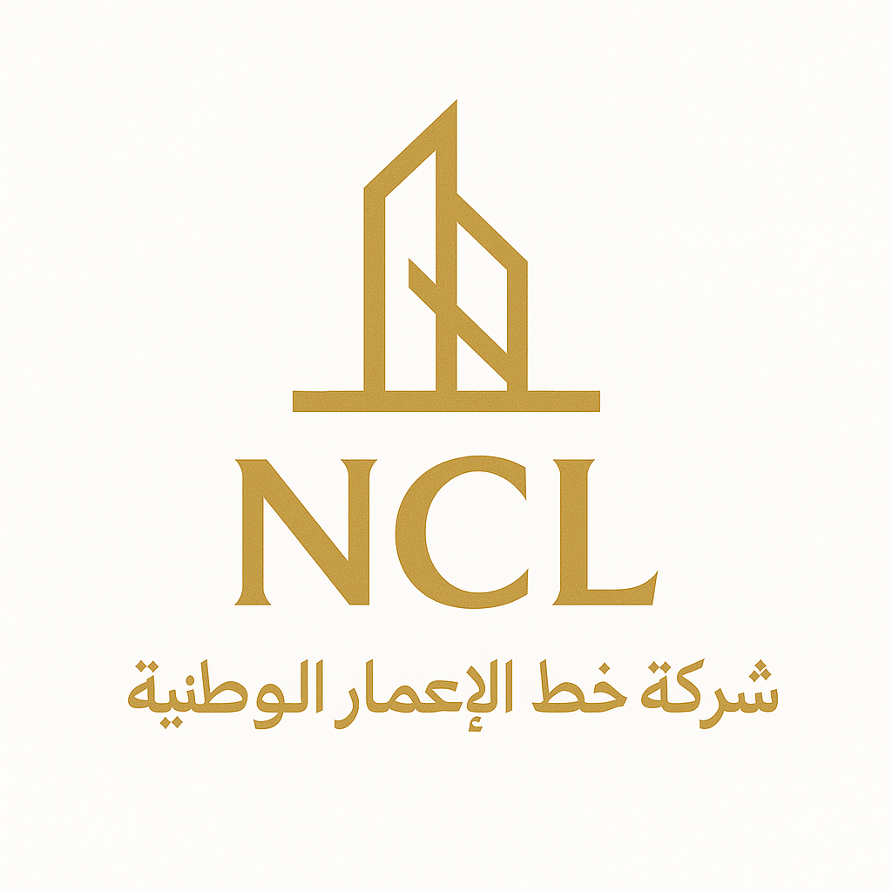

<!DOCTYPE html>
<html lang="ar" dir="rtl">
<head>
  <meta charset="UTF-8" />
  <title>دليل السياسات التنفيذية – النسخة المجتمعية العُمانية</title>
  <meta name="viewport" content="width=device-width, initial-scale=1" />
  
</head>
<body>
  

    

      🌐 من سلسلة <strong>RS-X31 للمعرفة السيادية</strong> – النسخة المجتمعية العُمانية (Community Edition)
    

    

      
    

    <h1>🏗️ دليل السياسات التنفيذية – شركة خط الإعمار الوطنية 2025</h1>
    

      <strong>إعداد وتنفيذ:</strong> 
      مركز النواة الميداني – وحدة التطوير المؤسسي 
      شركة خط الإعمار الوطنية (NCL)
    

    

    

      🇴🇲 <strong>النسخة المجتمعية – Community Edition</strong> 
      هذا الإصدار يمثل النسخة المفتوحة الموجهة للفضاء العُماني، 
      ويهدف إلى تعزيز الوعي المؤسسي والمعرفي انطلاقًا من القيم الوطنية، 
      في انسجام مع التوجيهات السامية ورؤية عُمان 2040.
    

    <h2>📘 مقدمة: عن توازن التحيّز في فضاء الوعي الرقمي</h2>

    

      يأتي هذا الإصدار في إطار الرؤية الوطنية لبناء
      <strong>فضاء وعيٍ رقميٍ متوازن</strong>، يُعيد ضبط العلاقة بين الإنسان والنظام،
      وبين التقنية والمعرفة، ليصبح الفكر نفسه جزءًا من منظومة الأمن السيادي للدولة الذكية.
    

    

      إنّ مضمون هذه الوثائق <strong>مستمد من النهج السامي لجلالة السلطان هيثم بن طارق المعظم حفظه الله</strong>،
      ومن الخطابات والكلمات السامية التي أرست مبادئ الحوكمة، والكفاءة، والوعي الوطني.
      وهي تنسجم في جوهرها مع <strong>رؤية عُمان 2040</strong> التي جعلت من الإنسان محور التنمية،
      ومن المعرفة والتقنية ركائز لبناء الدولة الذكية ذات القرار الواعي والمسؤول.
    

    

      فهي تُترجم عمليًا روح التوجيه السامي إلى سياسات تنفيذية ووعي مؤسسي ذكي،
      وتأتي ضمن <strong>منظومة RS-X31 – The Royal Smart Cross-Sectional Nervous System</strong>،
      بوصفها الذراع الفكرية والإجرائية لمفهوم الدولة الذكية والسيادة المعرفية.
    

    

      إطلاق هذه الوثائق لا يُعد عملًا نظريًا فحسب، بل هو
      <strong>إعادة معايرة للاتزان الإدراكي داخل المنظومة الوطنية</strong>،
      حيث يُعاد تشكيل الإدراك المؤسسي من خلال وعيٍ منضبطٍ لا يخاصم،
      وفكرٍ نقديٍّ لا يصطدم، بل يُوجّه بوعيٍ وولاءٍ وعمق.
    

    

      ✨ <strong>هكذا هم القادة... يصنعون التوازن قبل القرار.</strong>
    

    

    <h2>🧠 المخطط المفاهيمي: الاتزان البنيوي في فضاء الوعي الرقمي</h2>

    

                   ┌──────────────────────────────┐
                   │    RS-X31 – The Royal Smart  │
                   │  Cross-Sectional Nervous System │
                   └────────────┬─────────────────┘
                                │
                                ▼
                   ┌──────────────────────────────┐
                   │     المعرفة السيادية        │
                   │  (Sovereign Knowledge Layer) │
                   └────────────┬─────────────────┘
                                │
        ┌───────────────────────┼───────────────────────┐
        ▼                       ▼                       ▼
┌────────────┐          ┌────────────┐          ┌────────────┐
│  الإنسان  │          │   النظام   │          │  التقنية  │
│ (Human)   │          │ (System)   │          │ (AI Layer) │
└────┬───────┘          └────┬──────┘          └────┬──────┘
     │                        │                     │
     └────────────┬────────────┴────────────┬────────┘
                  ▼                         ▼
        ╔══════════════════════════════════════════╗
        ║       التوازن الإدراكي والمعرفي         ║
        ║   (Cognitive & Structural Equilibrium)   ║
        ╚══════════════════════════════════════════╝
    

    

      🕊️ <strong>المعرفة تولّد القرار… والقرار يحفظ الوعي.</strong> 
      هذا هو قلب منظومة <strong>RS-X31</strong> – جهاز عُمان العصبي الذكي.
    

    

    <h2>📘 عن الدليل</h2>

    

      يهدف هذا الدليل إلى توثيق السياسات التنفيذية والتشغيلية لشركة
      <strong>خط الإعمار الوطنية</strong> بوصفها نموذجًا مؤسسيًا للتحول الذكي المبني على المعرفة،
      والتكامل الرقمي، والوعي الميداني المستند إلى الرؤية الوطنية في الإدارة والتنمية.
    

    
يضم الدليل:

    <ul>
      <li><strong>التمهيد:</strong> التمييز بين التوجيه والسياسة والقرار.</li>
      <li><strong>الملحقات (1–7):</strong> توثيق التحولات الميدانية، وفهم المكتب، ونشيد المحافظات،
        وسياسات التدفق المعرفي، واستخدام واتساب المؤسسية، ومؤشرات العقود التشغيلية.</li>
      <li><strong>الخاتمة:</strong> نص وُضع ليُقرأ بعقل ووعي، لا كوثيقة إدارية جامدة.</li>
    </ul>

    

    <h2>🌐 عرض الدليل الإلكتروني</h2>

    

      📄 HTML:
      <a href="https://abdulaziz-commits.github.io/ncl-policy-guide-2025/NKS-NCLPolicy0420251108.html" target="_blank">
        عرض الملخص التنفيذي للدراسة الشاملة (إصدار HTML)
      </a>
    

    

    <h2>🔗 روابط مرفقة</h2>

    

      🎵 <strong>نشيد المحافظات – 2025 (نسخة صوتية)</strong> 
      🔗 <a href="https://drive.google.com/file/d/1QWd1_aeNnMcau8MyaAjFbiKqmMw1_q1l/view?usp=drivesdk" target="_blank">
        الاستماع إلى النشيد
      </a>
    

    

      📄 <strong>الملخص التنفيذي للدراسة الشاملة (PDF)</strong> 
      🔗 <a href="https://drive.google.com/file/d/1UHi06F-PZVfO3TMOcaKjEXu1FI7DhXfC/view?usp=drivesdk" target="_blank">
        عرض الملخص التنفيذي (PDF)
      </a>
    

    

    <h2>🧭 NKS – National Knowledge Security Series 2025</h2>

    

      📘 <a href="https://abdulaziz-commits.github.io/ncl-policy-guide-2025/NKS0520251109.htm" target="_blank">
        NKS0520251109 – أنواع التحيّز في الذكاء الاصطناعي وآليات الاتزان البنيوي
      </a>
    

    

      📗 <a href="https://abdulaziz-commits.github.io/ncl-policy-guide-2025/NKS0520251110.html" target="_blank">
        NKS0520251110 – التحيّز الإدراكي والاتزان المعرفي في الأنظمة الذكية (NCBM)
      </a>
    

    

      🔗 سلسلة الأمن المعرفي الوطني – إصدارات 2025:
      التكامل بين النظرية والتطبيق.
    

    

      <h3>🏛️ منظومة الدولة الذكية والسيادة المعرفية</h3>
      <h3 style="margin-top: 0; color: #444; font-size: 1rem;">
        المسار الفرعي: سلسلة الأمن المعرفي الوطني (NKS Series 2025)
      </h3>

      

      

        📘 
        <a href="https://abdulaziz-commits.github.io/ncl-policy-guide-2025/NKS0520251109.htm" target="_blank" style="text-decoration: underline; color: #1a73e8; font-weight: 600;">
          NKS0520251109 – أنواع التحيّز في الذكاء الاصطناعي وآليات الاتزان البنيوي
        </a>
      

      

        📗 
        <a href="https://abdulaziz-commits.github.io/ncl-policy-guide-2025/NKS0520251110.html" target="_blank" style="text-decoration: underline; color: #1a73e8; font-weight: 600;">
          NKS0520251110 – التحيّز الإدراكي والاتزان المعرفي في الأنظمة الذكية (NCBM)
        </a>
      

      

        🔗 سلسلة الأمن المعرفي الوطني – إصدارات 2025:
        التكامل بين النظرية والتطبيق.
      

      

        هذه النسخة المجتمعية صادرة عن <strong>شركة خط الإعمار الوطنية (NCL)</strong>
        عبر <strong>مركز النواة الميداني</strong>، وتقدم إطارًا معرفيًا وطنيًا في مجال
        الأمن المعرفي والأمن الرقمي، دون أن تتضمن أي بيانات تشغيلية أو مراسلات رسمية
        أو تفاصيل حساسة تتعلق بالأجهزة أو الأفراد.
      

      

        يُستخدم هذا الإصدار لأغراض التوعية المؤسسية والمجتمعية فقط،
        ولا يُعد بديلاً عن الأدلة السياساتية أو التوجيهات الداخلية المعتمدة
        داخل مؤسسات الدولة أو داخل شركة خط الإعمار الوطنية.
      

      

        © RS-X31 – The Royal Smart Cross-Sectional Nervous System 
        🕓 Timestamp: <strong>T251109</strong>
        &nbsp;|&nbsp;
        🔒 SHA-ID: <strong>NKS-X31-AW</strong>
      

    

    

    

      

        هذه الوثيقة إصدار أول قابل للتطوير والمراجعة، 
        وتخضع لمتابعة مركز النواة الميداني ضمن مسار الحوكمة والتكامل المؤسسي
        لشركة خط الإعمار الوطنية.
      

      

        © 2025 – شركة خط الإعمار الوطنية 
        جميع الحقوق محفوظة.
      

    

  

</body>
</html>
